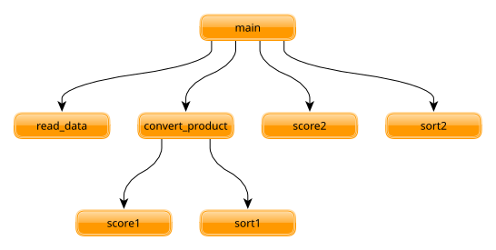
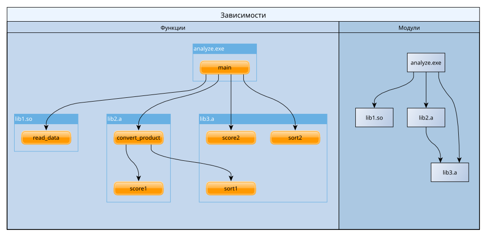

# Модуль №1: «Анализатор цен продуктов»

Необходимо разработать программу, которая анализирует цены на продукты. Программу следует разбить на отдельные "единицы компиляции" и произвести их сборку используя `Makefile`. Задание дано в виде нескольких вариантов.

## Формат входных данных

На первой строке даны два числа $1 \le N, K \le 100$ — количество продуктов и цен для каждого продукта соответственно. Каждая последующая из $N$ строк содержит:

- Название продукта — одно слово состоящие из латинских букв в разном регистре
- $K$ дробных чисел — цены на продукт в различных магазинах

**Пример:**

```
3 5
Apple 1 2 3 4 5
Banana 9 8 7 6 5
Watermelon 11.1 22.2 33.3 44.4 55.5
```

Даны три продукта ($N=3$) и для каждого даны цены из пяти ($K=5$) магазинов.

## Формат выходных данных

Должен соответствовать шаблону:

```
Total score: 5320
Best product: Apples (score: 424)
```

## Единый алгоритм (для всех вариантов)

1) Считать все продукты и их массивы цен.
2) Вызвать `convert_product` для каждого продукта, чтобы получить их оценки. Функция `convert_product` использует первую сортировку и первую функцию оценки.
3) Отсортировать список по оценке, используя второй алгоритм сортировки.
4) Применить вторую функцию оценки и получить "общую" оценку набора продуктов.
5) Найти и вывести продукт, чья оценка ближе всего к общей (по модулю разницы). Если несколько — можно вывести любой.

**Функции сортировки:**

- Сортировка пузырьком `bubble_sort`
- Сортировка вставками `insertion_sort`
- Сортировка выбором `selection sort`

Общая сигнатура функций сортировки:

```cpp
struct Index {
    long long int index; // исходная позиция
    double value;        // значение
};
void sort(Index arr[], long long int n);
```

**Функции оценки:**

- Минимум `minimum` ($\min_i a_i$)
- Максимум `maximum` ($\max_i a_i$)
- Среднее `average` ($\sum_i a_i \over n$)
- Медианное `median` ($a_k : \sum_i ( a_i < a_k ) = \sum_i ( a_i > a_k )$)
- Сумма `sum` ($\sum_i a_i$)
- Произведение `product` ($\prod_i a_i$)
- Геометрическое сресднее `geometric` ($\sqrt[n] {\prod_i a_i}$)
- Гармоническое среднее `harmonic` ($n \over \sum_i {1 \over a_i}$)

Общая сигнатура функций оценки:

```cpp
double score(double arr[], long long int n);
```

Структуру продукта можно объявить следующим образом:

```cpp
#include <string>

struct Product {
    std::string name;     // название продукта
    double prices[100];   // цены
};
```

## Структура решения

- Две функции сортировки (могут совпадать для каких-то вариантов)
- Две функции оценки (могут совпадать для каких-то вариантов)
- Функция чтения данных `void read_data(Product[] products, long long int n, long long int k);`
- Функция преобразования продуктов `ScoredProduct convert_product(Product p, long long int k);`
- Функция `int main()`

**Граф зависимостей между функциями:**



Все перечисленные функции распределяются в отдельные "единицы компиляции" согласно варианту. Каждая единица компиляции компилируется в библиотеку (статическую либо динамическую, также согласно варианту).

Имя библиотеки — список имён функций внутри неё в алфавитном порядке, разделённых дефисом, с префиксом lib и соответствующим расширением.

Например, разбиение может быть следующим:

| Тип Библиотеки       | Список Функций              |
| -------------------- | --------------------------- |
| динамическая (`.so`) | `read_data`                 |
| статическая (`.a`)   | `convert_product`, `score1` |
| статическая (`.a`)   | `sort1`, `score2`, `sort2`  |

**Что приводит к следующим зависимостям между библиотеками:**



`Makefile` должен корректно отражаеть структуру решения и выполнять сборку `analyze.exe` по команде:

```sh
make analyze.exe
```

## Что задаётся вариантом задания

- 2 фунции сортировки
- 2 функции оценки
- количество "единиц компиляции" и их тип (динамическая/статическая)
- разбиение функций по "единицам компиляции"
- два числа $X, Y$ каждое по модулю больше единицы
    - $X$ отвечает за то, сколько цен оставить после сортировки
    - $Y$ (нечетное) отвечает за то, сколько товаров оставить после сортировки
    - Для каждого варианта гарантируется что во входных данных $N \ge X$, а также $K \ge Y$

Вариант получается посредством запуска Python скрипта `module01-variant.py`, который запрашивает ваши ФИО и выдаёт на их основе вариант задания.

**Пример варианта задания:**

```
pyhton module01-variant.py
Введите ФИО: Рогонов Степан Алексеевич
ID варианта: 1334509102

Алгоритмы сортировки:
  1) selection_sort
  2) insertion_sort

Функция оценки:
  - sum

X (цены после сортировки): 16
Y (товары после сортировки): 19

Единицы компиляции, всего: 3
  [1] dynamic: libsum.so
      функции: sum
  [2] static: libinsertion_sort-read_data.a
      функции: insertion_sort, read_data
  [3] static: libconvert_product-selection_sort.a
      функции: convert_product, selection_sort

Структуры:
  struct Index { long long int index; double value; };
  struct Product { std::string name; double prices[100]; };
  struct ScoredProduct { std::string name; double score; };

Сигнатуры (общие):
  int main();
  void read_data(Product[] products, long long int n, long long int k);
  ScoredProduct convert_product(Product p, long long int k);

Сигнатуры (прочие):
  void selection_sort(Index arr[], long long int n);
  void insertion_sort(Index arr[], long long int n);
  double sum(double arr[], long long int n);

```

С такими требованиями подойдёт `Makefile` следующего содержания:

```makefile
analyze.exe: main.cpp libsum.so libinsertion_sort-read_data.a libconvert_product-selection_sort.a
	g++ -std=c++17 main.cpp \
	    libinsertion_sort-read_data.a libconvert_product-selection_sort.a \
	    -L. -lsum -o analyze.exe

libsum.so: sum.cpp
	g++ -std=c++17 -shared -fPIC sum.cpp -o libsum.so

libinsertion_sort-read_data.a: insertion_sort.cpp read_data.cpp
	g++ -std=c++17 -c insertion_sort.cpp read_data.cpp
	ar rcs libinsertion_sort-read_data.a insertion_sort.o read_data.o

libconvert_product-selection_sort.a: convert_product.cpp selection_sort.cpp
	g++ -std=c++17 -c convert_product.cpp selection_sort.cpp
	ar rcs libconvert_product-selection_sort.a convert_product.o selection_sort.o

```

Итого в репозитории окажутся файлы:

```
.
├── convert_product.cpp
├── insertion_sort.cpp
├── main.cpp
├── Makefile  <-- обратите внимание, он должен быть БЕЗ расширения
├── module01-variant.py  <-- скрипт для получения своего варианта
├── read_data.cpp
├── README.md  <-- исходный файл с заданием
├── selection_sort.cpp
└── sum.cpp
```

## Замечания

> [!IMPORTANT]
>
> Оставьте описание вашего варианта ХОТЯ БЫ в комментарии к Pull Request, иначе есть риск получить 0 баллов при несовпадении варианта, что сгенерирует проверяющий с тем, который получился у вас.

- Раскладывать каждую функцию в отдельный файл не обязательно.

- В данной реализации `Makefile` из примера статичные библиотеки НЕ САМОДОСТАТОЧНЫ.

  Например `libconvert_product-selection_sort.a` не содержит в себе функции `sum` которая должна использоваться в функции `convert_product` и это нормально. На дальнейших занятиях мы изучим более подходящие инструменты для полноценной разработки на C++.
